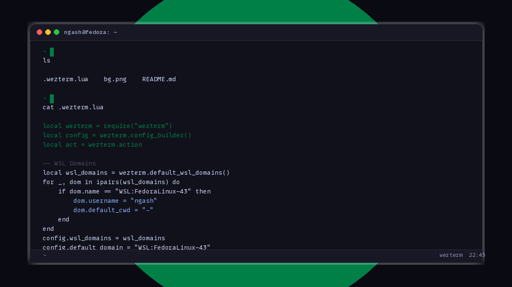
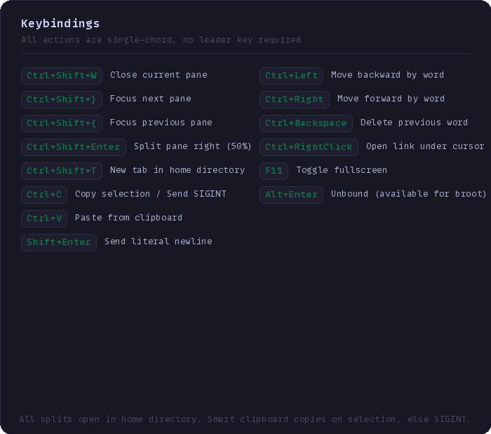

# wezterm

A terminal config that knows exactly what it wants.  
WSL2. Fedora. MonoLisa. Green cursor. No tab bar.



## What makes it different

Tabs are hidden because panes show everything at once.  
The leader key is absent because single chords are faster.  
Ctrl+C is smart -- it copies selected text, or sends SIGINT if nothing is highlighted.  
Ctrl+V pastes from the clipboard.  
Ctrl+arrows skip words in the shell.  
Shift+Enter sends a literal newline.  

Every binding is one press. No chording. No guesswork.

## Keys



## How it looks

The color scheme is custom. The background has a faint texture that adds depth without distraction.  
The cursor is a blinking block in a specific green (`#007F47`). Easy to find in a busy terminal.  
The visual bell fades in and out with easing. The audible bell is disabled.  
The window launches centred on your active monitor at 1800x970, title bar height subtracted so the outer frame lands exactly where you expect.

## How it works

This config was built on WSL2 with a Fedora distro. It autodetects the WSL domain, sets the user and home directory, and makes it the default. No manual switching.

MonoLisa Nerd Font at 11pt with 1.2 line height. Glyph warnings are silenced because the font is trusted.  
Alt+Enter is unbound by default so broot can claim it. Fullscreen moved to F11.  
Scrollback holds 10 000 lines. Animation runs at 60 fps. Max framerate is 144.

## Get it

```bash
git clone git@github.com:Masalale/wezterm.git ~/.config/wezterm
```

On Windows, symlink the file:

```cmd
mklink %USERPROFILE%\.wezterm.lua %USERPROFILE%\source\repos\wezterm\.wezterm.lua
```

Restart WezTerm. The config reloads every launch.

## Adjust it

Everything is in one file, clearly sectioned. Change the font, swap the color scheme, tweak the window size, add or remove bindings. The config builder API means no surprises.
